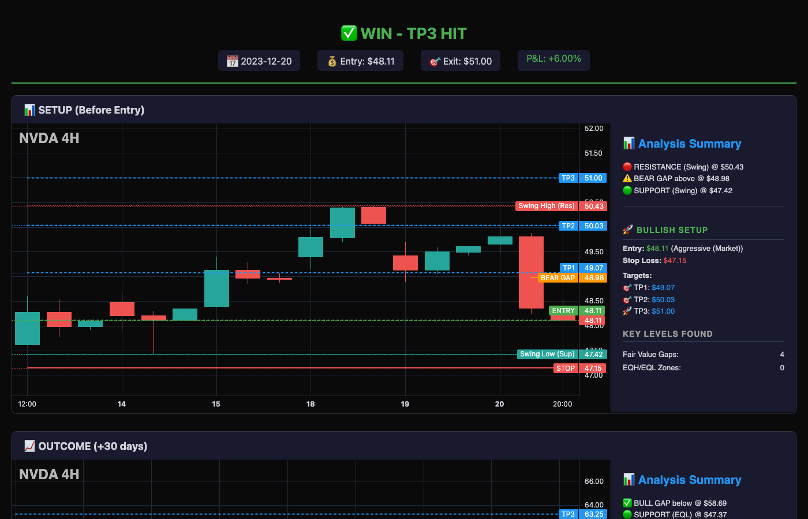
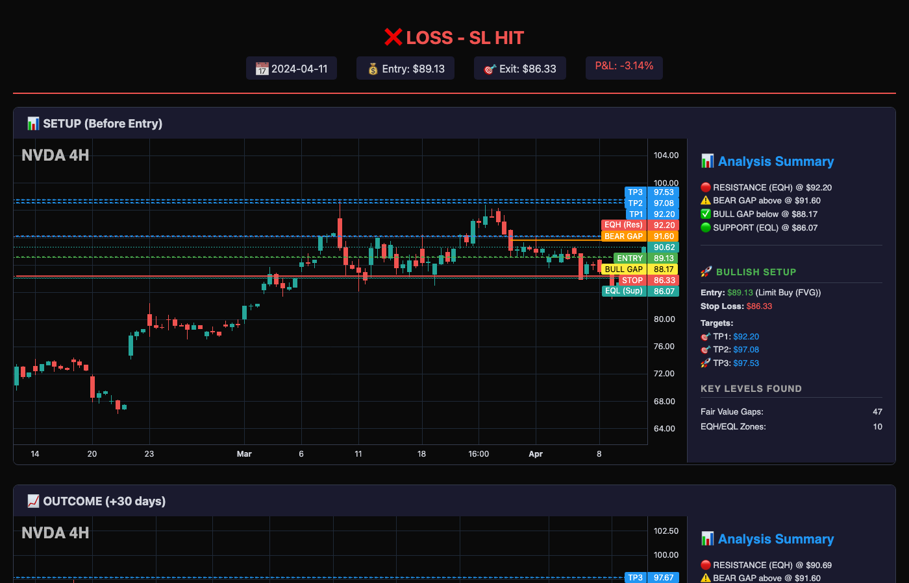

# ICT Buy the Dip Analyzer

A Python-based algorithmic trading tool that detects **ICT (Inner Circle Trader) concepts** to generate actionable trade plans. This analyzer identifies liquidity pools, imbalances, and market structure to find high-probability long entries.


---

## 📚 ICT Concepts Explained

Understanding *why* this strategy works requires knowledge of how institutional traders and market makers operate.

### 🔴 Equal Highs/Lows (EQH/EQL) — Liquidity Magnets

**What they are:**  
Equal Highs (EQH) and Equal Lows (EQL) are price levels where multiple swing points cluster at nearly the same price. These levels represent **liquidity pools** — concentrations of stop-loss orders.

**Why they matter:**
- **Retail traders place stops above EQH and below EQL** — these are obvious "resistance" and "support" levels.
- **Market makers hunt these stops** — large institutions need liquidity to fill massive orders. They push price into these zones to trigger stop-losses, absorbing retail orders as counterparty liquidity.
- **EQH acts as resistance... until it's raided** — price often sweeps through EQH/EQL before reversing.

**How this tool uses them:**
- Identifies EQL as potential entry zones (price will sweep below before reversal)
- Places stop-loss *slightly below* EQL to avoid getting stopped out during liquidity grabs
- Uses the liquidity sweep as confirmation of reversal

---

### 📊 Fair Value Gaps (FVGs) — Imbalances in Price

**What they are:**  
A Fair Value Gap is a 3-candle pattern where the wicks of candle 1 and candle 3 don't overlap, leaving a "gap" in price. This gap represents an **imbalance** — price moved so aggressively that no trades occurred in that zone.

**Why price reacts at FVGs:**
- **Unfilled orders exist in the gap** — institutions that missed entries will look to fill orders when price returns.
- **Price seeks efficiency** — markets tend to fill imbalances before continuing the trend.
- **FVGs act as magnets** — price is "drawn" back to these zones before making the next major move.

**Bullish vs Bearish FVGs:**
- **Bullish FVG**: Gap created by an up-move → expect price to retrace INTO the gap, find support, and continue higher.
- **Bearish FVG**: Gap created by a down-move → expect price to rally INTO the gap, find resistance, and continue lower.

**How this tool uses them:**
- Identifies nearest bullish FVG below current price as entry zone
- Combines FVG with EQL for confluence (strongest setups)
- Uses FVG midpoint as a refined entry target

---

### 📈 Power of 3 (PO3) — Market Maker Algorithm

**What it is:**  
The Power of 3 describes a recurring 3-phase market cycle that institutions use to accumulate positions:

1. **Accumulation** — Smart money quietly builds positions. Price consolidates. This is often where EQL/EQH form.

2. **Manipulation** — Price is pushed *against* the intended direction to:
   - Trigger stop-losses (liquidity grab)
   - Create FVGs (imbalances to return to)
   - Trap retail traders on the wrong side

3. **Distribution** — Price explodes in the real direction as institutions distribute their positions to trapped retail traders.

**Why stops are placed below EQL:**
- The **manipulation phase** specifically targets obvious stop-loss zones.
- Placing stops *just below* EQL means you get stopped out during the liquidity raid.
- This tool places stops **further below** to survive the manipulation phase.

---

### 🎯 The Trading Logic

This analyzer combines these concepts into a systematic approach:

```
1. FIND EQL (Equal Lows)
   └── Identifies where retail stops are clustered

2. FIND BULLISH FVG (below current price)
   └── Identifies imbalance zone where price should react

3. ENTRY = EQL or FVG zone
   └── Enter when price approaches these levels

4. STOP LOSS = Below EQL (with buffer)
   └── Survives the manipulation/liquidity sweep

5. TAKE PROFITS = Based on next EQH/resistance levels
   └── TP1: Conservative (nearest resistance)
   └── TP2: Moderate (prior swing high)
   └── TP3: Aggressive (next major EQH)
```

---

## ✨ Features

### 📊 Core Analysis
- **Fair Value Gap (FVG) Detection**: Identifies bullish and bearish imbalances
- **Equal Highs/Lows (EQH/EQL)**: Detects liquidity zones and stop-hunt levels
- **Swing Point Detection**: Finds market structure highs and lows
- **Automatic Trade Plans**: Generates Entry, Stop Loss, and 3 Take Profit levels

### 🌐 Web Interface
- **Real-time Market Scanner**: Monitors 500+ tickers from S&P 500 and Nasdaq 100
- **Interactive Charts**: TradingView Lightweight Charts with 2 years of history
- **Live Results**: Streaming updates as each ticker is scanned
- **Proximity Filter**: Only shows tickers within 1.5% of calculated entry

### 📈 Backtesting
- **Historical Signal Scanner**: Tests strategy across 700+ trading days
- **Performance Metrics**: Win rate, P&L, TP1/TP2/TP3 hit rates
- **Chart Snapshots**: Generates HTML charts for every trade found

---

## 🌐 Live Demo (Render)

🔗 **Live Web Scanner**:  
https://ict-buy-the-dip.onrender.com/

> ⚠️ **Render Performance Disclaimer**  
> This application is hosted on Render's **free tier** (Demo Mode).  
> - Initial load may take **30–60 seconds** due to cold starts  
> - Scanner limited to **20 popular tickers** with **15-minute intervals**  
> - For full 500+ ticker scanning, run locally  

---

## 🚀 Quick Start

### 1. Clone & Setup
```bash
git clone https://github.com/jerrylin-23/ict_buy_the_dip.git
cd ict_buy_the_dip

# Create virtual environment
python3 -m venv venv
source venv/bin/activate  # On Windows: venv\Scripts\activate

# Install dependencies
pip install -r requirements.txt
```

### 2. Run Web Scanner
```bash
source venv/bin/activate
python src/app.py
```
Open **http://127.0.0.1:5001** in your browser.

### 3. Run Backtest
```bash
source venv/bin/activate
python src/run_backtest.py NVDA   # or AAPL, GOOGL, SPY, etc.
```
Results saved to `src/samples/<symbol>_daily_<date>/`

---

## 📊 Backtest Results (Dec 2024)

| Symbol | Trades | Win Rate | Avg P&L | TP1 Hit | TP2 Hit | TP3 Hit |
|--------|--------|----------|---------|---------|---------|---------|
| NVDA   | 286    | **74.5%** | +4.63%  | 74%     | 60%     | 49%     |
| GOOGL  | 248    | **77.0%** | +2.68%  | 77%     | 54%     | 42%     |
| AAPL   | 221    | **74.7%** | +2.38%  | 75%     | 60%     | 43%     |

### 📸 Example Charts

#### NVDA 2023-12-20 ✅ WIN (TP3)


#### NVDA 2024-04-11 ❌ LOSS (SL)


> 📁 **Browse all 700+ interactive charts**: [src/samples/](src/samples/)

---

## 📁 Project Structure

```
ICT/
├── src/
│   ├── app.py              # Flask web application
│   ├── ict_analyzer.py     # Core ICT analysis logic
│   ├── run_backtest.py     # Backtesting script
│   ├── tickers.txt         # Watchlist (S&P 500 + Nasdaq 100)
│   ├── templates/          # HTML templates
│   └── samples/            # Backtest output (charts & summaries)
├── requirements.txt        # Python dependencies
├── generate_tickers.py     # Script to regenerate watchlist
└── README.md
```

---

## 🛠️ Configuration

### Watchlist
Edit `src/tickers.txt` to customize the scanner watchlist:
```
AAPL
NVDA
TSLA
# Add your tickers here
```

### Environment Variables
| Variable | Default | Description |
|----------|---------|-------------|
| `DEMO_MODE` | `false` | Set to `true` for limited scanning (20 tickers, 15-min intervals) |

### Scanner Sensitivity
In `src/app.py`, adjust the `near_entry` threshold (default: 1.5%):
```python
'near_entry': bool(0 <= dist_pct <= 0.015)
```

---

## 📋 Requirements

- Python 3.10+
- Flask
- yfinance
- pandas
- numpy

```bash
pip install -r requirements.txt
```

---

## 🤝 Contributing

1. Fork the repository
2. Create a feature branch (`git checkout -b feature/amazing-feature`)
3. Commit changes (`git commit -m 'Add amazing feature'`)
4. Push to branch (`git push origin feature/amazing-feature`)
5. Open a Pull Request

---

## 📄 License

This project is licensed under the MIT License - see the [LICENSE](LICENSE) file for details.

---

## ⚠️ Disclaimer

This tool is for **educational purposes only**. It is not financial advice. Trading involves substantial risk of loss. Always do your own research and consult with a licensed financial advisor before making investment decisions.

**The concepts explained here are interpretations of publicly available ICT methodology. This project is not affiliated with or endorsed by Inner Circle Trader.**
